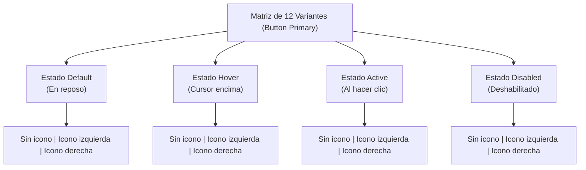

# Sistema de Botones para Design System

Guía para diseñar e implementar un sistema de botones consistente, escalable y accesible.

[Volver a la UD1](01_Planificacion_de_Interfaces.md) | [Volver al Índice General](../INDICE_GENERAL.md) | 🌐 [Abrir infografía interactiva en el navegador](sistema_botones.html)

---

## 🎯 ¿Por qué un Sistema de Botones?

Un sistema de diseño de botones garantiza:
* **Consistencia visual:** Todos los elementos interactivos responden con las mismas reglas de forma, tamaño y color.
* **Eficiencia en el diseño:** No se vuelve a diseñar un botón desde cero; se reutiliza una definición probada.
* **Mapeo directo a código:** La misma estructura de variantes de Figma se traslada de manera directa a componentes frontend en CSS/Tailwind o frameworks como React/Angular.

---

## 🔢 Las 12 Variantes del Botón Primario

Una matriz compuesta por **4 estados de interacción** $\times$ **3 posiciones de icono**:

### Comportamiento de los 4 Estados:
1. **Default (En reposo):** Apariencia base del botón tras cargar la página antes de que el usuario interactúe con él.
2. **Hover (Cursor encima):** Feedback visual inmediato cuando el puntero se sitúa sobre el botón (ligero oscurecimiento del tono base).
3. **Active (Al pulsar / Clic):** Feedback durante el instante de pulsación o clic (tono más oscuro que simula hundimiento).
4. **Disabled (Deshabilitado):** El botón no permite interacción (por ejemplo, en un formulario con campos requeridos sin rellenar).

> ⚠️ **Regla de accesibilidad para el estado Disabled:**  
> Nunca utilices simplemente `opacity: 0.5` sobre el botón activo para deshabilitarlo. Utiliza colores de bajo contraste específicos con fondos grises neutros (`#E5E7EB`) y texto gris (`#9CA3AF`) para garantizar claridad y control sin generar artefactos visuales.

---

## 📊 Jerarquía: Tipos de Botones

No todos los botones deben competir por la misma atención visual:

| Tipo | Color / Estilo | Nivel de atención | Cuándo utilizarlo | Ejemplos |
| --- | --- | :---: | --- | --- |
| 🔵 **Primary Button** | Fondo sólido destacado (`#2563EB`) | **Alto** | La acción principal de la pantalla o sección (**máximo 1 por vista**). | "Comprar ahora", "Crear cuenta". |
| ⚪ **Secondary Button** | Fondo neutro suave o secundario | **Medio** | Acciones secundarias importantes pero subordinadas a la principal. | "Cancelar", "Volver atrás". |
| 🔲 **Outline Button** | Fondo transparente con borde visible | **Medio-Bajo** | Acciones alternativas o terciarias. | "Ver detalles", "Compartir". |
| 👻 **Ghost Button** | Sin fondo ni borde (solo texto/icono) | **Bajo** | Acciones de bajo peso visual o en áreas densas. | "Omitir", "Cerrar ventana". |

---

## 📏 Escala de Tamaños

| Tamaño | Altura | Padding Vertical | Padding Horizontal | Separación (Gap) | Radio de borde | Uso recomendado |
| --- | :---: | :---: | :---: | :---: | :---: | --- |
| **Large** | **48px** | 16px | 24px | 12px | 8px | Pantallas táctiles móviles, llamadas a la acción (*Hero CTAs*), landing pages. |
| **Medium** ⭐ | **40px** | 12px | 20px | 8px | 6px | **El 90% de los botones** en aplicaciones web, paneles y formularios estándar. |
| **Small** | **32px** | 8px | 16px | 6px | 4px | Filas de tablas densas, tarjetas compactas, barras de herramientas secundarias. |

---

## 🔧 Especificaciones Técnicas (Valores Exactos)

### Tokens de Color para Botón Primario:
* **Default:** Fondo `#2563EB` | Texto `#FFFFFF`
* **Hover:** Fondo `#1D4ED8` | Texto `#FFFFFF`
* **Active:** Fondo `#1E40AF` | Texto `#FFFFFF`
* **Disabled:** Fondo `#E5E7EB` | Texto `#9CA3AF`

### Tokens Tipográficos:
* **Large:** 16px | Peso: 600 (SemiBold) | Line Height: 1.0
* **Medium:** 14–16px | Peso: 600 (SemiBold) | Line Height: 1.0
* **Small:** 12–14px | Peso: 500–600 (Medium/SemiBold) | Line Height: 1.0
