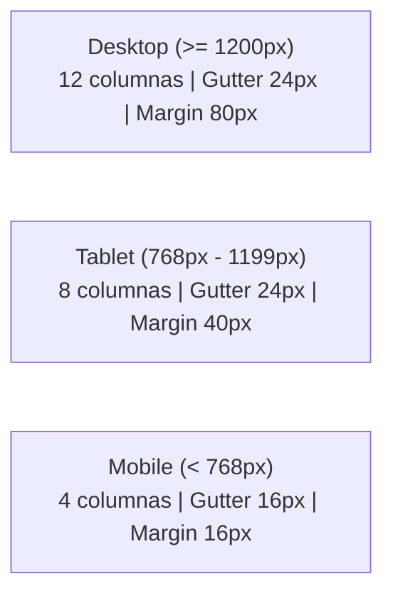

# Sistema de Grids para Design System

La base de la consistencia, orden y profesionalismo en el diseño de interfaces web.

[Volver a la UD1](01_Planificacion_de_Interfaces.md) | [Volver al Índice General](../INDICE_GENERAL.md) | 🌐 [Abrir infografía interactiva en el navegador](https://hljagonzalez.github.io/APUNTES-DIWEB-CURSO-26-27/UD1_Planificacion_Interfaces/sistema_grids.html)

---

## 🎯 ¿Por qué necesitas un sistema de grids?

* ⚡ **Velocidad:** No pierdes tiempo decidiendo espaciados aleatorios; todo encaja de forma automática.
* ✨ **Consistencia:** Todo queda alineado armónicamente, transmitiendo orden y solidez visual.
* 🤝 **Colaboración:** Diseñadores y desarrolladores manejan la misma escala métrica, facilitando la maquetación en código.
* 📱 **Responsive:** El contenido se redistribuye ordenadamente en pantallas móviles, tablets y escritorios.

---

## 1️⃣ El Sistema de Rejilla de 8pt (8pt Grid System)

Todos los espaciados y dimensiones de los componentes deben ser **múltiplos de 8px**:
- Espacio entre elementos (`margin`).
- Espacio interno de componentes (`padding`).
- Separación entre elementos hijos (`gap`).
- Altura y anchura de botones, tarjetas e inputs.

> **Regla de oro:** Nunca utilices valores arbitrarios como 13px, 17px o 21px. Utiliza siempre múltiplos de 8.

### Comparativa: Sin sistema vs Con 8pt Grid

| Elemento | Sin sistema (Caótico) | Con 8pt Grid (Profesional) |
| --- | --- | --- |
| **Padding de tarjeta** | 17px *(aleatorio)* | **24px** *(3 × 8)* |
| **Margen inferior** | 13px *(aleatorio)* | **16px** *(2 × 8)* |
| **Separación (gap)** | 19px *(aleatorio)* | **32px** *(4 × 8)* |
| **Altura de bloque** | 127px *(no alinea)* | **128px** *(16 × 8)* |

---

### La Escala Completa de Espaciado

| Token / Multiplicador | Medida | Cuándo usarlo | Ejemplos prácticos |
| :---: | :---: | :--- | :--- |
| **1 × 8** | **8px** | Espacios muy pequeños | Entre icono y texto; entre badge y texto adyacente. |
| **2 × 8** | **16px** | Espacios pequeños estándar | Entre párrafos de texto; padding interno de botones. |
| **3 × 8** | **24px** | Espacios medianos ⭐ *(El más común)* | **Padding de tarjetas (cards)**; separación entre bloques de un componente. |
| **4 × 8** | **32px** | Espacios grandes | Separación (*gap*) entre tarjetas en una rejilla. |
| **5 × 8** | **40px** | Espacios medianos-grandes | Márgenes laterales de contenedores compactos. |
| **6 × 8** | **48px** | Espacios muy grandes | Separación vertical entre secciones de una página. |
| **7 × 8** | **56px** | Espacios amplios | Encabezados de sección con alto respiro visual. |
| **8 × 8** | **64px** | Espacios mayores | Padding vertical de secciones *Hero* o *Footer*. |

---

## 2️⃣ Rejilla de Distribución (Layout Grid)

Mientras el **8pt Grid** controla los espaciados micro (paddings, margins, gaps), el **Layout Grid de columnas** controla el **ancho macro** que ocupan los contenedores principales.

### Configuración por dispositivo

| Dispositivo | Nº Columnas | Tipo (Figma) | Separación (Gutter) | Margen exterior (Margin) |
| --- | :---: | :---: | :---: | :---: |
| **Desktop** | **12** | Stretch | 24px *(3 × 8)* | 80px *(10 × 8)* |
| **Tablet** | **8** | Stretch | 24px *(3 × 8)* | 40px *(5 × 8)* |
| **Mobile** | **4** | Stretch | 16px *(2 × 8)* | 16px *(2 × 8)* |

> **Ventaja de configurar "Stretch" en Figma:** Las columnas se estiran automáticamente según el ancho del marco (*frame*). Figma recalcula las columnas sin necesidad de números fijos, emulando fielmente el comportamiento de CSS Grid y Flexbox.

### Distribución de columnas en Desktop (12 cols)
- **3 columnas:** 1/4 del ancho (4 tarjetas por fila).
- **4 columnas:** 1/3 del ancho (3 tarjetas por fila, o sidebar lateral).
- **6 columnas:** 1/2 del ancho (layout a dos columnas).
- **8 columnas:** 2/3 del ancho (área de contenido principal junto a sidebar).
- **12 columnas:** Ancho completo (Hero, banners transversales).

---

## 3️⃣ Sistema Aplicado en un Diseño Real

Observa la integración conjunta del 8pt Grid y el Layout Grid:
- **Header:** Padding vertical 24px, padding horizontal 40px.
- **Área principal:** Ocupa 8 de las 12 columnas.
- **Barra lateral (Sidebar):** Ocupa 4 de las 12 columnas.
- **Separación entre Principal y Sidebar:** 24px de gap.
- **Tarjetas internas:** Cada una con padding interior de 24px y separadas entre sí por 24px.
